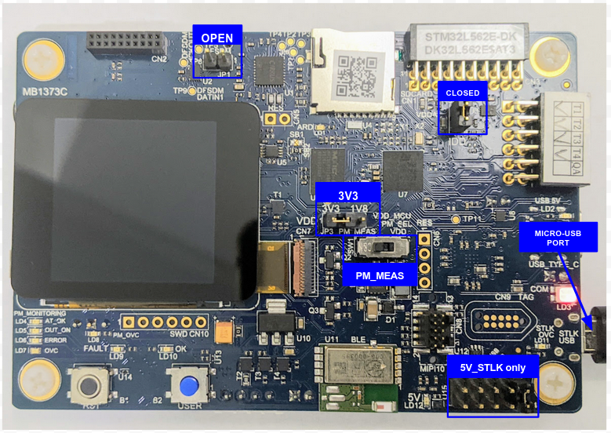
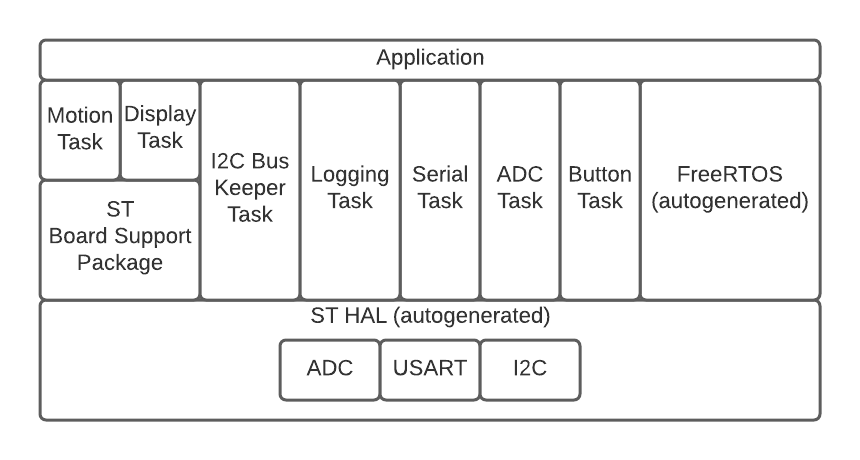

# Sensors Converge 2021 Demonstration

## Motivation
This demo application offers a way to sample multiple sensors on a periodic basis.  The focus is more on the acquisition of the data rather than its use.

FreeRTOS was used since it is open source and widely used.  The scheduler it offers also gives an easy way to decouple periodic processes such that their processing rate can be changed without (ideally) affecting the timing of other tasks.

The user will be able to utilize this project in a few ways:
1. Download the pre-built demo application to the dev kit and view the output in a serial terminal
2. Modify the existing source code and experiment with timing
3. Apply this architecture to the common task of periodically reading sensors

## Getting Started
### Prerequisites
1. Get the STM32L562E-DK development kit from Digi-Key, Mouser, Newark, Arrow, or directly from ST. https://www.st.com/en/evaluation-tools/stm32l562e-dk.html
2. Configure the jumpers and switches on the top

3. Configure the jumpers and switches on the bottom

4. Download and install STM32CubeIDE v1.7.0 https://www.st.com/en/development-tools/stm32cubeide.html
5. Update the ST-Link Firmware on the development kit
    1. Connect the dev kit’s CN17 connector directly to an available USB port on your computer.  Note that there are two micro USB connectors on the PCB
	2. Open STM32CubeIDE
	3. Goto Help->ST-LINK Upgrade, then click “Open in update mode”
	4. Leave “Change Type” unchecked and the MCU Output set to default, then click “Upgrade”.  Note that our version used was V3J8M3
    
    5. The process takes about a minute and should complete successfully
6. Clone the demo project from GitHub

### Running the Demo (Precompiled Binary)
1. Do the prerequisites listed above
2. Connect the dev board’s CN17 connector to the computer using a micro USB cable.  A direct connection, without USB hub, is recommended.  Note that there are two micro USB connectors on the board
3. Open a serial terminal (e.g. TeraTerm), and connect to the ST-Link device (115200, 8 bit data, no parity, 1 stop bit, no flow control)

4. Open STM32CubeProgrammer https://www.st.com/en/development-tools/stm32cubeprog.html
5. Select ST-Link from the dropdown on the right, and click Connect

6. Click Open File, and navigate to the binary file (in the releases folder)

7. Click Download. If you experience any issues, you may need to do a full chip erase first in the Erasing and Programming tab, and then program the binary again

8. Press the RST button
9. Observe the LD10 green LED start blinking.  You should also see the initial startup message in your terminal window, then it should start streaming sensor data as shown:

### Running the Demo (Building from Source)
1. Do the prerequisites listed above.
2. Open STCubeIDE, and set the workspace as the root directory of the Git clone
3. File -> Import, then General -> Existing Projects into Workspace

4. Navigate to the stcube\_sensors\_converge\_demo subfolder, then click Finish

5. Connect the dev board’s CN17 connector to the computer using a micro USB cable.  A direct connection, without a USB hub, is recommended.  Note that there are two micro USB connectors on the board
6. Open a serial terminal (e.g. TeraTerm), and connect to the ST-Link device (115200, 8 bit data, no parity, 1 stop bit, no flow control)

7. Build the project (Ctrl + B)
8. Run the project (Run -> Run)
9. Observe the LD10 green LED start blinking.  You should also see the initial startup message in your terminal window, then it should start streaming sensor data as shown:

## Firmware Design
The purpose of this demonstration project is to offer a way to sample multiple sensors on a periodic basis. There are various ways to do this as discussed in the presentation. FreeRTOS was used given it is open source and widely used.

### Background
The STM32L562E-DK dev kit was chosen due to the quantity and variety of sensors it comes with. To keep the demo simple we only used a subset of those available.

| Type | Name | Interface | Notes |
| ----------- | ----------- | ----------- | ----------- |
| Input | Button | GPIO pin | |
| | Inertial module (accelerometer and gyro) | I2C | Interrupt pin |
| | Digital microphone | PDM | |
| | Audio codec | I2C | Codec control |
| | Analog microphone | SAI | Codec data |
| | Touchscreen | I2C | Interrupt pin |
| | Energy monitoring MCU | UART | Also provides temperature |
| | Internal temp sensor | Analog |
| Output | LEDs | GPIO pin | Green and red |
| | LCD | FSMC | |
| | Stereo headphone | SAI | Codec data |
| | Serial port | UART | Virtual COM port through the ST-Link |

### Application
When the FreeRTOS scheduler starts it will begin sampling the sensors at their specified sample rates. When a sample is available it is reported to a logging task that collects all of the latest samples and prints them to the serial port.

### Architecture
Since the application was mainly interacting directly with sensors, there was not much middleware. In this diagram layers can only call downward or laterally without skipping a layer (application cannot call directly into the ST BSP for example).

### Tasks
The application is divided into the following tasks. In a production application less tasks could have been used depending on the application, however this was intended to demonstrate the concepts from the presentation.

| Name | Purpose | Owned Peripheral(s) | Comm Structures | Priority |
| ----------- | ----------- | ----------- | ----------- | ----------- |
| Idle | Handles execution when there is nothing to be done. | Blinks an LED as an external indication the program is running. | Green LED | None | Lowest |
| Serial | Prints strings | USART1 | Queue for incoming char arrays | Low |
| I2C bus keeper | Processes transactions on the I2C bus | I2C1 | Queue for incoming bus transaction requests, notification when complete | Medium |
| Sample logging | Records new samples from sampling tasks | N/A | Queue for sample acquisition updates | Medium |
| Motion | Samples the accelerometer axes on the IMU | None | None | High |
| Button | Debounces and monitors the user button state | GPIO | None | Medium |
| Display | Draws screens and reports touch events | FSMC | None | High |
| ADC | Samples the internal temperature sensor | ADC1 | None | High |
